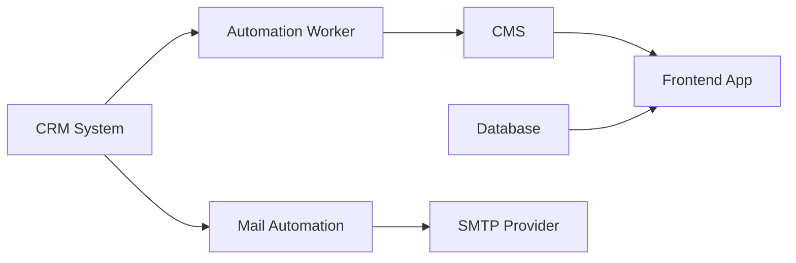

# System Map

## Summary

This sample stack has three main areas:

- public app delivery
- operational CRM truth
- outbound automation

## Example Architecture

## Notes

- `frontend-app` is the public presentation layer.
- `crm-system` is the operational source of truth.
- `automation-worker` is downstream from the CRM.
- external services should be documented as dependency nodes, not as owned systems.
- every node in this diagram is defined in `system-index.yaml`, either as a project or under `externals:`.

